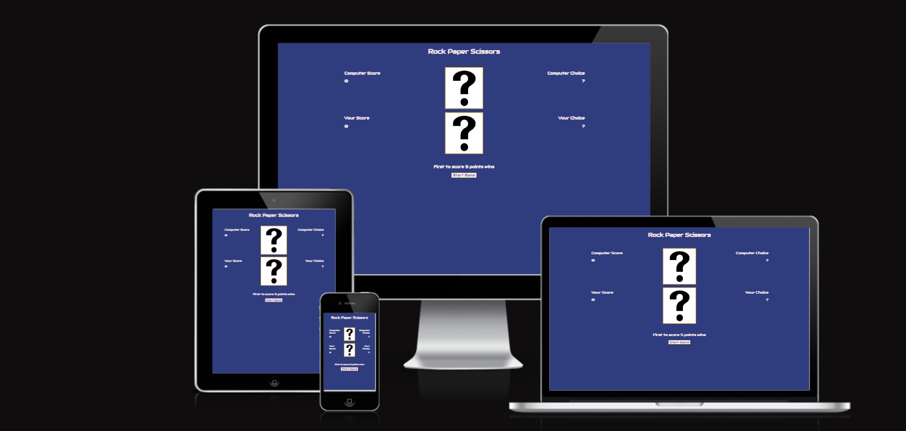
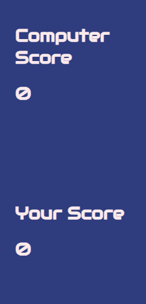
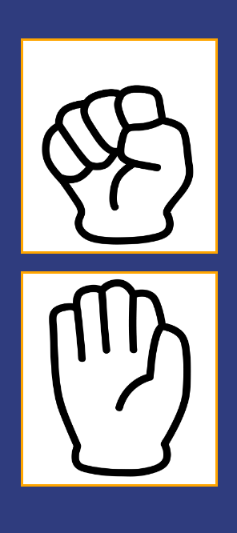
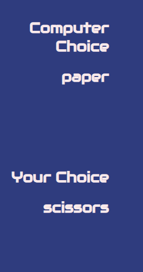
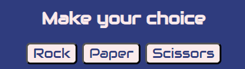
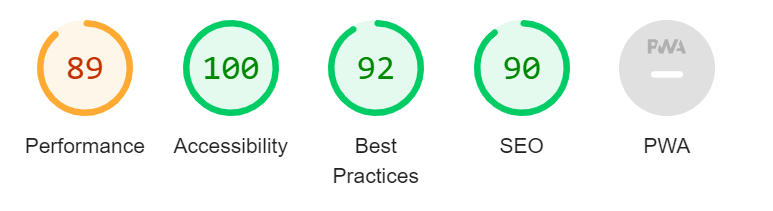

# Galway Soccer Club

[Rock Paper Scissors](https://richieon88.github.io/rockpaperscissorsgame/) is an app for playing a simple game of rock paper scissors. Users play a game of rock paper scissors against the computer over five rounds and see if they can win. The user has to make a choice between rock, paper or scissors by clicking the buttons corresponding to there choice.
The computer choices are random and its up to the user to try and come out on top.
Its a simple game of chance that anyone can play and have fun with.

## Technologies used

- HTML
- CSS
- Javascript
- Google fonts

## Features

### Existing Features

- **Title**

  - The title of the game is featured at the top of the game at all times.
  - It clearly states the name of the game the users are playing.

- **Score Areas**

  - The score areas are where the current scores of the game are displayed.
  - There is an area for the computer's score and one for the user's score.
  - When the user or the computer win a round the score display goes up by one.

- **Image Area**

  - The image area is where the images of the choices made by the user and computer are shown.
  - When the user clicks one of the buttons to make a choice of either rock, paper or scissors a corresponding image is shown in this section.
  - The randomly selected choice of the computer is also diplayed with an image, just above the user's image
  - The images are displayed one above the other to show a head to head style.

- **The Choices Area**

  - The choices area displays the option chose by the computer and user.
  - By default it shows a question mark but it updates with text of the choice made.

- **Control Area**

  - The control area is where the game is played from.
  - Its located at the bottom of the page below the images area.
  - It features three buttons that make-up the options of rock, paper and scissors.
  - When one of the buttons is clicked the user makes that choice and an image of that choice is displayed.
  - Clicking one of the buttons also triggers the computer to make their choice and an image of there choice is also displayed.
  - At the start of the game this area has a start game button and text stating the win conditions
  - When the win conditions are met by either the computer or the user a message is displayed to relay the outcome and a play again button is shown.
  - If the play again button is clicked the game restarts so the user can play again.

### Features Left to Implement

- A feature where the user could adjust the amount of rounds it takes to win could be implemented
- An option to play with a timer could be implemented if the user wanted to play a quicker game.

## Testing

- I tested that the game works in different browsers: Chrome, Firefox,Edge.
- I tested on different size screens to make sure it was responsive and everything functions as intended.
- I tested all the buttons to make sure they function in the correct manner.
- I had friends and family play it to make sure there were no bugs.

### Validator Testing

- ##### HTML

  - No errors were found when passing through the official W3C validator.
  - Warnings for trailing slash on void elements has no effect and interacts badly with unquoted attribute values are shown
  - When saving on Codeanywhere it automaticly formats the html file to have trailing slashes even when they are deleted.

- ##### CSS

  - No errors or warnings were found when passing through the official W3C (Jigsaw) validator.

- ##### Accessibility and performance

  - Using lighthouse in devtools I confirmed that the website is performing well, accessible and colors and fonts chosen are readable.
    

### Bugs

- ##### Solved bugs

  - There was a bug in with the game not updating the scores correctly.
  - I fixed the javascript code by adding +1 when incrementing scores in the game

  ***

  - I had a bug with the text choices appearing in the wrong section of the game area.
  - I fixed it by attaching the right id to the right section og html.

- ##### Unsolved bugs

  - None.

## Deployment

- The site was deployed to GitHub pages. The steps to deploy are as follows:
  - In the GitHub repository, navigate to the Settings tab
  - From the source section drop-down menu, select the Master Branch
  - Once the master branch has been selected, the page will be automatically refreshed with a detailed ribbon display to indicate the successful deployment.

The live link can be found here - [Rock Paper Scissors](https://richieon88.github.io/rockpaperscissorsgame/)

## Credits

### Content

- The fonts used where taken from Google Fonts.

### Media

- All the images used for the rock, paper and scissors choices are from [Vecteezy.com](https://www.vecteezy.com/)
- The default question mark image is taken from [Publicdomainpictures.net](https://www.publicdomainpictures.net/)
